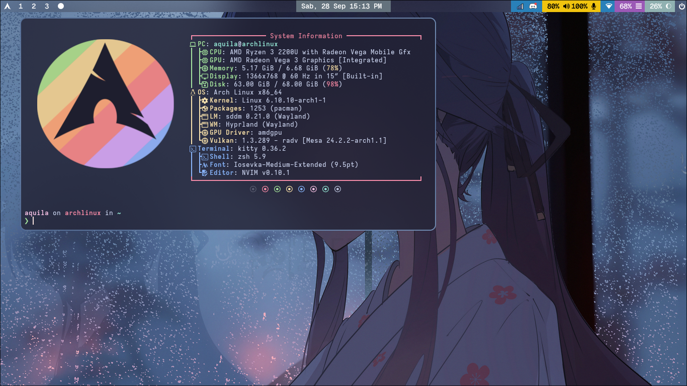

# [Aquila's](https://github.com/rizkyilhampra) Dotfiles

> [!NOTE]
> Working on progress to make nicer README

Contain all of my configuration in Arch Linux (btw) + Hyprland WM.

## Screenshots

## Packages / Applications

| Name                                                                                                                                                                                                         | Description                                                                                                     |
| ------------------------------------------------------------------------------------------------------------------------------------------------------------------------------------------------------------ | --------------------------------------------------------------------------------------------------------------- |
| [kitty](https://sw.kovidgoyal.net/kitty/) [alacritty](https://github.com/alacritty/alacritty)                                                                                                                | Terminal                                                                                                        |
| [hyprland](https://sw.kovidgoyal.net/kitty/)                                                                                                                                                                 | Window manager                                                                                                  |
| [zsh](https://zsh.sourceforge.io/) [starship](https://starship.rs) [ohmyzsh](https://github.com/ohmyzsh/ohmyzsh)                                                                                             | Shell, framework & prompt style                                                                                 |
| [tmux](https://github.com/tmux/tmux/wiki)                                                                                                                                                                    | Multiplexer                                                                                                     |
| [spicetify](https://spicetify.app/)                                                                                                                                                                          | Customization for Spotify                                                                                       |
| [comfy](https://github.com/Comfy-Themes/Spicetify)                                                                                                                                                           | Spicetify theme                                                                                                 |
| [eza](https://github.com/eza-community/eza)                                                                                                                                                                  | Another `ls` command replacement                                                                                |
| [zoxide](https://github.com/ajeetdsouza/zoxide)                                                                                                                                                              | Another `cd` command replacement                                                                                |
| ~~[t-smart-tmux-session-manager](https://github.com/joshmedeski/t-smart-tmux-session-manager)~~ [sesh](https://github.com/joshmedeski/sesh)                                                                  | Tmux session manager powered by zoxide                                                                          |
| [monaspace](https://monaspace.githubnext.com/) [geistmono](https://github.com/vercel/geist-font) [jetbrains-mono](https://github.com/JetBrains/JetBrainsMono) [iosevka](https://github.com/be5invis/Iosevka) | Fonts                                                                                                           |
| [catppuccin](https://github.com/catppuccin/catppuccin) [tokyonight](https://github.com/folke/tokyonight.nvim)                                                                                                | Themes i use in browser, terminal, text editor, and all the bunch stuff                                         |
| [swww](https://github.com/LGFae/swww)                                                                                                                                                                        | Wallpaper daemon                                                                                                |
| [waybar](https://github.com/Alexays/Waybar)                                                                                                                                                                  | Bar                                                                                                             |
| [age](https://github.com/FiloSottile/age)                                                                                                                                                                    | Encryption program                                                                                              |
| [rmpc](https://github.com/mierak/rmpc)                                                                                                                                                                       | MPD client like [ncmpcpp](https://github.com/ncmpcpp/ncmpcpp) but with display album art support out of the box |
| [ncmpcpp](https://github.com/ncmpcpp/ncmpcpp)                                                                                                                                                                | MPD client                                                                                                      |
| [mpd](https://github.com/MusicPlayerDaemon/MPD)                                                                                                                                                              | Music player daemon                                                                                             |
| [reflector](https://wiki.archlinux.org/title/Reflector)                                                                                                                                                      | Mirrorlist generator                                                                                            |
| [protonvpn-cli](https://wiki.archlinux.org/title/ProtonVPN#Official_command-line_interface)                                                                                                                  | VPN with ProtonVPN in CLI                                                                                       |
| [yay](https://github.com/Jguer/yay)                                                                                                                                                                          | Pacman wrapper                                                                                                  |
| [zen-browser](https://github.com/zen-browser/desktop) [chromium](https://archlinux.org/packages/extra/x86_64/chromium/) [thorium-browser](https://github.com/Alex313031/Thorium)                             | Browsers                                                                                                        |
| [fastfetch](https://github.com/fastfetch-cli/fastfetch) [pfetch-rs](https://github.com/Gobidev/pfetch-rs) | Fetching system information |
| [delta](https://github.com/dandavison/delta) | Better diff syntax highlight, used for `git diff` and needed for `lazygit` |
| [lazygit](https://github.com/jesseduffield/lazygit) | TUI git client |
| [lazysql](https://github.com/jorgerojas26/lazysql) | TUI SQL client |
| [lazydocker](https://github.com/jesseduffield/lazydocker) | TUI docker client |
| [serpl](https://github.com/yassinebridi/serpl) | TUI for search and replace text |
